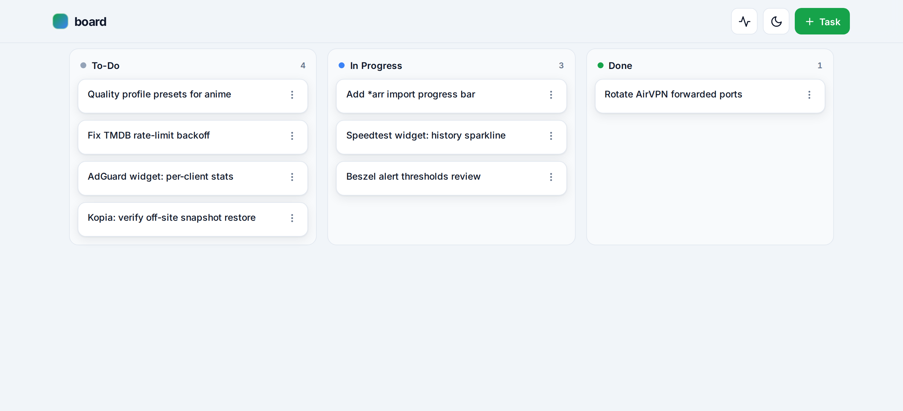

<h1 align="center">board</h1>

<p align="center">
  <a href="LICENSE"></a>
  <a href="https://github.com/samuelloranger/board/releases"></a>
  <a href="https://github.com/samuelloranger/board/actions/workflows/release.yml"></a>
  
</p>



A cross-client kanban board for AI agents. One central board, shared by every
MCP-capable AI client on your machine — Claude Code, Codex CLI, Cursor, and
Antigravity. Not a todo list one agent scribbles in: a **coordination bus** for
a fleet of heterogeneous agents.

Single Go binary = MCP server + terminal CLI + local web UI. SQLite storage, no
runtime dependencies, no auth, fully local.

## Install

```sh
curl -fsSL https://raw.githubusercontent.com/samuelloranger/board/main/install.sh | sh
```

The installer downloads the binary to `~/.board/bin` and offers to register the
`board` MCP server with each AI client it detects (Claude Code, Codex CLI,
Cursor, Antigravity). Pass `--yes` to skip the prompts:

```sh
curl -fsSL .../install.sh | sh -s -- --yes
```

Restart your AI clients afterward so they pick up the new MCP server.

## What it does

- **Statuses:** To-Do → In Progress → Done, plus an archive flag.
- **Scope:** tasks are per-project (auto-detected from the current git repo) or
  global. Tags, priority, due dates, and per-task notes.
- **Killer feature — cross-agent coordination:**
  - `resume` restores your working context in one call (in-progress tasks +
    anything handed to you), so a Codex session can continue what a Claude Code
    session started.
  - `handoff` parks a task for another agent or a human, with context.
  - A live activity board shows what every agent is doing across every project.

## CLI

```sh
board add "Wire up auth"      # create a task in the current project
board board                   # show the To-Do / In Progress / Done columns
board list --all              # list tasks across all projects
board move 3 in_progress      # move task #3
board note 3 "blocked on key" # append a note
board archive 3               # archive task #3
board serve                   # open the web UI at http://127.0.0.1:7420
```

## MCP tools

`create_task`, `list_tasks`, `get_task`, `update_task`, `move_task`,
`archive_task`, `unarchive_task`, `delete_task`, `add_note`, `get_board`,
`handoff`, `resume`.

## Claude Code plugin

The `plugin/` directory is a Claude Code plugin that bundles the MCP server
config, a usage skill, and activity hooks. Install it as a plugin for a richer
Claude-native experience; the MCP server works identically in every other
client without it.

## License

MIT — see [LICENSE](LICENSE).
